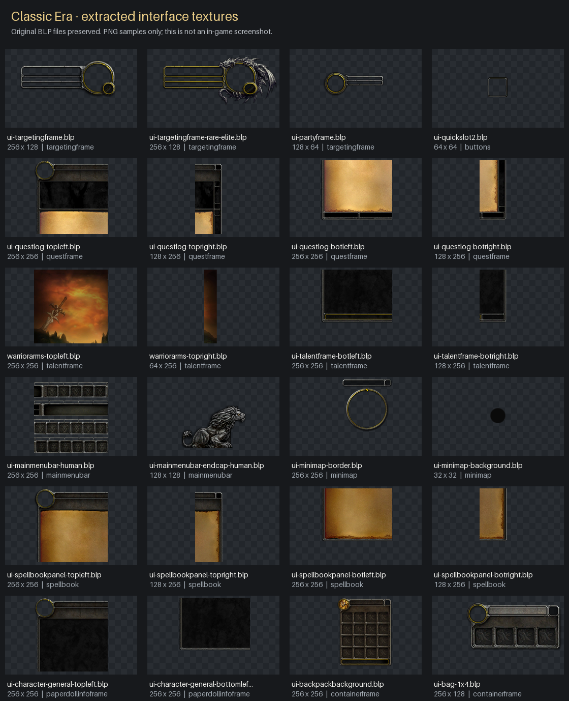

# Classic UI - Forever Reframed

[CurseForge project](https://www.curseforge.com/wow/addons/classic-ui-forever-reframed/preview)
— project ID `1699904`; initial alpha submission is awaiting completion and moderation.

**Project goal: restore the entire Classic Era in-game interface in World of
Warcraft: Forever, except nameplates.** This open-source project covers unit
frames, action bars,
minimap, talents, quests, world and flight maps, character panels, spellbooks,
bags, banks, professions, mail, auctions, social panels and other windows and
controls. Nameplates remain as provided by the Forever client.

Each part of the interface is intended to be selectable in the game's native
Settings panel, so players can choose where to use Classic styling and where to
keep Forever's presentation.

**Current implementation — early development:** version **0.2.2-dev** includes an
integrated settings panel and three experimental window-border modules, alongside
diagnostics and a texture
preview. Everything starts disabled. These are partial borders, not restored
Classic windows; unit-frame and HUD restoration is not implemented. The source
TOC targets **Classic Era 1.15.9**; the experimental modules require **Forever beta
1.60.1.69893 / candidate Interface 16001**. All new behavior remains unvalidated
in game while beta access is unavailable.

Open the addon with **`/foreverui`**. Version `0.2.2-dev` introduces the
**Classic UI - Forever Reframed** name and a distinct `ForeverReframed` addon
folder and namespace. It starts with fresh `ForeverReframedDB` settings; older
development settings and reports are left untouched and are not imported.



*Extracted texture samples, including talents and quest panels. This is a
reference sheet, not a screenshot of a completed in-game interface.*

## What's included

- An original modular Lua addon with `/foreverui` settings, per-module selections,
  client diagnostics and a texture preview.
- Experimental side and bottom borders for quest interactions, the combined
  talents/spellbook window and the world map. The native top decoration, portrait,
  title, buttons, dimensions, content layout and gameplay remain unchanged.
- **8,827 unchanged BLP textures (162.2 MiB)** in
  [assets/classic-era](assets/classic-era), with provenance and SHA-256 hashes.
- Local, read-only CASC extraction tools for obtaining interface resources from
  an installed client.
- 28 behavioral tests running under Lua 5.1 through Lupa.
- A [Classic Frames compatibility audit](docs/classicframes-audit.md).
- An [in-game restoration checklist](docs/ui-coverage.md), distinguishing
  extracted artwork, diagnostic coverage and functional replacement work.

The original code is **MIT licensed**. Blizzard artwork is separately attributed
and is not relicensed under MIT. See [NOTICE.md](NOTICE.md).

## Restoration roadmap

The full-interface goal includes all of the following work. Complete restoration
of these areas is still pending:

- **Unit frames:** player, target, target of target, pet, party and raid frames,
  with their health/resource bars, cast bars, buffs and debuffs.
- **Windows and maps:** talents, spellbooks, quests, character panels, bags,
  bank, professions, vendors, mail, auctions, social panels, world and flight maps.
- **HUD and shared controls:** action bars, stance/pet bars, minimap, micro menu,
  XP/reputation bars, tooltips, chat, menus, dialogs, tabs and other in-game controls.

Work starts with validating the setup panel and the three partial window-border
modules in the beta, then building unit-frame styling and complete Classic
window layouts, followed by the remaining HUD and shared controls. Available
modules will be added to the same settings panel as they are implemented.
Nameplates remain native throughout. The [full checklist](docs/ui-coverage.md)
tracks the scope and distinguishes finished work from planned restoration.

## Try the development addon

When updating from this project's development versions before `0.2.2-dev`,
disable the previous development copy before enabling the renamed addon. The
new package uses the `ForeverReframed` directory and its own saved settings.

### Classic Era

1. Run `python3 tools/package_addon.py --target era` and close Classic Era.
2. Extract the archive's `ForeverReframed` folder into that client's
   `Interface/AddOns` directory. Packaging includes the required artwork.
3. Start the game and enable **Classic UI - Forever Reframed** in the addon list.
4. Run `/foreverui status`, then `/foreverui preview` while out of combat.

On macOS, the usual destination is
`/Applications/World of Warcraft/_classic_era_/Interface/AddOns/ForeverReframed`.

### Forever beta

Build the separate beta archive. The following in-game steps are for when beta
access becomes available:

```sh
python3 tools/package_addon.py --target forever-beta
```

1. Close the beta client.
2. Extract the `ForeverReframed` folder from
   `dist/ForeverReframed-0.2.2-dev-forever-beta.zip` into
   `/Applications/World of Warcraft/_classic_beta_/Interface/AddOns/`.
3. Start the beta and enable **Classic UI - Forever Reframed** in the addon list.
4. Open `/foreverui` outside combat. Confirm that the master switch and all module
   checkboxes start off. Open quest interactions, talents/spellbook and the map
   using the game's normal controls, then run `/foreverui inspect` for a baseline.
5. Enable the master switch and one available window module at a time. Check its
   border and native controls, then uncheck it to verify the original appearance
   returns. The combined talents/spellbook window has one checkbox.
6. Run `/foreverui preview`, close it with `/foreverui hide`, and use **Reset to defaults**
   to turn restoration off. Run `/foreverui inspect` and `/reload` to save the final
   report and settings locally.

This package uses candidate Interface `16001`, inferred from client version
`1.60.1`; the in-game `GetBuildInfo()` result must confirm it. Source inspection
identified `PlayerSpellsFrame` for Camelot talents and spellbook, the map frames
and native Settings registration functions. These findings do not establish
in-game compatibility. Modules require the exact version, build and candidate
Interface value, plus the expected unprotected frame structure. Unsupported
windows keep their native appearance. See [the beta validation log](docs/validation-forever.md).

The native Settings panel has a master switch, individual window checkboxes,
status messages, **Reset to defaults** and **Texture preview**. Selections persist
in `ForeverReframedDB.settings`. Disabling a module restores the border texture
alphas captured when it was enabled. Changes wait until combat ends; windows
loaded or reopened later are handled by the restoration engine. These mechanisms
have offline tests, but their actual rendering, interactions and combat behavior
still need beta validation. Nameplates have no restoration option.

### Commands and reports

| Command | Behavior |
| --- | --- |
| `/foreverui` or `/foreverui settings` | Opens the addon panel in native game Settings outside combat |
| `/foreverui status` | Reports client build and UI capabilities |
| `/foreverui inspect` | Includes frame availability/protection, Settings capabilities and restoration states |
| `/foreverui preview` | Toggles texture samples for unit frames, buttons, quests and talents |
| `/foreverui hide` | Closes the preview; Escape also works |

The preview closes when combat starts and cannot be opened during combat. It
does not modify native frames or display a functional talent tree. The diagnostic
report is stored in `ForeverReframedDB.lastReport`; the game saves it on reload
or logout. It contains no character, account or combat data. Load-on-demand
windows may appear absent until opened.

Version `0.2.2-dev` samples 25 named frames and reports native Settings API
presence and restoration states. The historical Era result of 19/21 came from
version `0.1.0-dev`, which had 21 probes. These are diagnostic samples, not counts
of all Classic frames or measurements of how much of the UI is restored.

The [first in-game smoke test](docs/validation-era.md) confirmed that the addon
loads, its native texture samples render and the diagnostic report persists on
Era 1.15.9. Combat behavior, broader compatibility and functional replacements
still require client testing. The automated tests use a simulated WoW environment.

## Development

Python 3.11 or newer:

```sh
python3 -m venv tools/python-env
tools/python-env/bin/python -m pip install -r tools/requirements.txt
tools/python-env/bin/python tests/run.py
python3 tools/package_addon.py
```

Archives are written to `dist/`. The default target is `era`; select
`--target forever-beta` for the separate beta package. Both include the one local
Classic dialog-border BLP listed in `RequiredMedia.txt`. Add
`--with-preview-media` to bundle the eight reference samples as well, for nine
BLPs total. The texture preview still uses native resources by default; the
window-border modules use their required bundled texture.

To generate a quick reference sheet:

```sh
tools/python-env/bin/python tools/preview_assets.py --source assets/classic-era
```

Use `--verify-all` for a full decode check, which can take several minutes.
Some modern BLP encodings are unsupported by Pillow; a decode limitation does
not by itself indicate a damaged original file.

## Interface resources

The initial local extraction from **Classic Era 1.15.9.69722** recovered
34,108 files: 31,142 BLP textures, 1,899 Lua files, 775 XML files and 292 TOC files
(approximately 1.8 GB). This includes 200 talent textures and the native talent
window source. The repository includes a selected frame-art pack, rather than
the full extraction, zone-map tile collection, shop assets or game UI source.
The reference pack and diagnostic probes are research resources; their inclusion
does not establish restoration progress or override the scope checklist.

The extraction explicitly selects the `wow_classic_era` product from the shared
CASC installation. See [the extraction guide](tools/casc/README.md). Full exports,
local installation reports, tool downloads and generated archives are ignored
by Git. Original BLP files are preserved; PNGs are only previews.

Classic clients contain some shared resources from other versions. Presence in
an Era archive does not prove that a texture is used by its Vanilla UI. For talent
layout research, follow `Blizzard_TalentUI_Vanilla.toc` and its `classic` sources.

## Relationship to Classic Frames

[Classic Frames](https://github.com/Daenarys/ClassicFrames) is a separate addon
and a useful compatibility reference. The audited version is **3.82 for Retail
12.1**, commit `55b66cc4b45e0a581b1a8d388980620f59f4f491`. Its project page lists
All Rights Reserved; this repository does not include its implementation.

Our addon is standalone at this stage. An optional dependency allows future
coexistence with a compatible Classic Frames release, but does not make the
Retail version compatible with Era or Forever. Changing a TOC number alone is
not a port.

## Roadmap

- Track all in-game UI families except nameplates in the
  [restoration checklist](docs/ui-coverage.md).
- Inspect the actual Forever client, build and UI APIs before final adaptation.
- Validate the prepared native Settings panel and three experimental border
  modules in the beta, including enabling, disabling, reloads and combat.
- Extend the setup panel as additional restoration modules are implemented.
  Unchecked modules retain Forever's appearance; nameplates always remain native.
- Restore window artwork and layout in isolated, reversible modules.
- Cover talents, quests, character panels, spellbooks, bags, bank, world map and
  flight map windows.
- Cover mail, trade, professions, auctions, social, pet, PvP and settings windows,
  including their buttons, tabs and other controls.
- Restore Classic unit frames, action bars, minimap and the remaining HUD while
  preserving secure gameplay.
- Validate each module in combat, at different UI scales and with other addons.

Talent trees and maps must retain the target client's data and mechanics.
The goal is a Classic-style in-game interface built on the supported client APIs,
with Forever's native nameplates retained. See [CONTRIBUTING.md](CONTRIBUTING.md)
to help.
